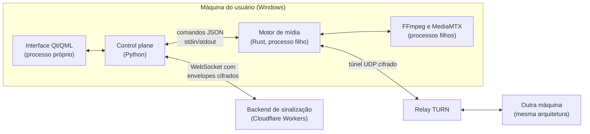

# Arquitetura

O Berou é dividido em quatro componentes, cada um com repositório, testes e CI próprios. Um quinto repositório faz a integração: ele fixa a revisão de cada componente usada em um release, e essas revisões são embutidas no build para que um diagnóstico saiba exatamente qual combinação estava instalada.

## Componentes

### Control plane (Python + Qt/QML)

**Implementado.** É o aplicativo que o usuário vê. Cuida da interface, do ciclo de vida das sessões, da comunicação com o backend de sinalização, das atualizações e do controle do motor de mídia.

A interface QML roda em um processo separado do runtime Python, e os dois conversam por um pipe. O motor de mídia é outro processo, filho do control plane. Com essa separação, uma falha no motor não derruba a interface: o control plane pode reiniciar o motor sem perder o estado da sessão na UI.

O control plane nunca toca em mídia. Frames, áudio e pacotes de rede ficam inteiramente no motor Rust e nos processos que ele controla. O Python só envia comandos e recebe eventos.

### Motor de mídia (Rust)

**Implementado.** Um executável que o control plane inicia como processo filho. A comunicação é um protocolo versionado de mensagens JSON, uma por linha, via stdin/stdout. O ciclo de vida do motor é amarrado ao do processo pai por um mecanismo do Windows que encerra os filhos quando o pai termina, evitando processos órfãos.

Responsabilidades:

- **Captura de tela** pela API de duplicação de desktop do Windows (DXGI), com fallback para GDI quando DXGI não está disponível ou quando a captura é de uma janela específica.
- **Captura de áudio** de um aplicativo específico (WASAPI process loopback), além de um canal de voz com Opus.
- **Codificação** em HEVC via FFmpeg, tentando encoders de hardware na ordem AMD AMF, NVIDIA NVENC e Intel QSV, e caindo para o encoder de software libx265. Um encoder que falha fica fora das tentativas por um período curto e volta a ser testado depois. O último que funcionou é tentado primeiro.
- **Distribuição**: o host captura e codifica o vídeo uma única vez e publica o stream no MediaMTX local via SRT. Os viewers consomem esse mesmo fluxo, sem novos processos de captura ou de codificação.
- **Transporte entre máquinas** por ICE com relay TURN. O tráfego entre as máquinas viaja cifrado e autenticado dentro de um túnel UDP controlado pelo motor.

### Backend de sinalização (Cloudflare Workers)

**Implementado.** É o único componente que roda em servidor. Usa Workers e Durable Objects para coordenar salas, controlar o acesso por convite, emitir credenciais temporárias de relay e distribuir atualizações. Ele só repassa mensagens de controle cifradas entre os participantes. Mídia nunca passa por ele.

Um Worker separado recebe a telemetria dos clientes e a encaminha para a stack de observabilidade (ver [Testes, diagnóstico e telemetria](testes-e-diagnostico.md)).

### Build e instalador

**Implementado.** Orquestra o build dos repositórios: compila o motor Rust, empacota o cliente Python com PyInstaller, gera um instalador por usuário com Inno Setup, assina o manifesto da versão e a publica em um de dois canais, Stable ou Beta. O cliente verifica a assinatura antes de instalar qualquer atualização.

## Como o vídeo chega ao viewer

1. O motor do host captura a tela e o áudio e os entrega ao FFmpeg, que codifica em HEVC e AAC e empacota em MPEG-TS.
2. O FFmpeg publica o stream via SRT no MediaMTX local, sempre em loopback.
3. A conexão SRT de cada viewer até o MediaMTX do host atravessa a internet encapsulada no túnel do motor Rust: ICE estabelece o caminho pelo relay TURN, e os datagramas viajam cifrados e autenticados dentro do túnel.
4. Na máquina do viewer, o motor expõe o stream em um endpoint local, e o player lê dali.

Assim, o SRT controla perda e latência de ponta a ponta entre o MediaMTX do host e o player do viewer, mas a rede pública só vê o túnel cifrado. Nenhuma porta SRT fica exposta fora da máquina.

A entrada de mais um espectador não altera o trabalho de captura ou de encoding do vídeo: o mesmo fluxo codificado é encaminhado a outra conexão. A carga principal de CPU e GPU desse pipeline não é replicada por viewer; o trabalho adicional está no transporte e no envio dos pacotes.
